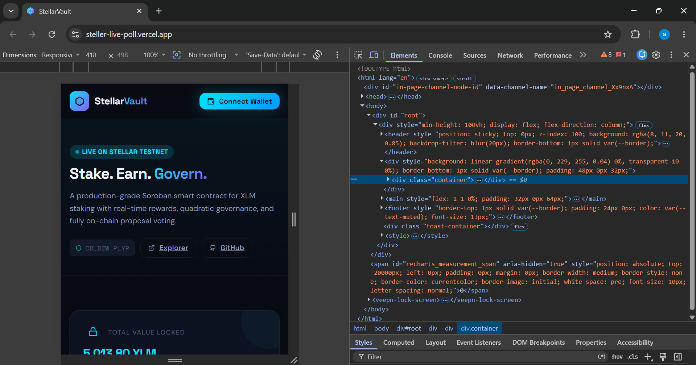
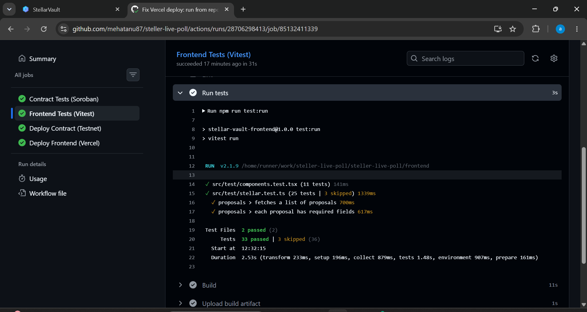

# StellarVault ⬡

> **Level 3 – Orange Belt Submission**  
> Production-grade XLM staking & governance dApp built on **Stellar Soroban**

[](https://github.com/mehatanu87/steller-live-poll/actions)
[](LICENSE)
[]()
[]()

---

## 🌐 Live Links

| Resource | Link |
|---|---|
| **Live Demo** | https://steller-live-poll.vercel.app |
| **GitHub Repo** | https://github.com/mehatanu87/steller-live-poll |
| **Contract ID** | `CBLBZWNHE26XAVUK6SRWFBCGKSRNEWPFGRHYTLXPKKSZO2VEQVN2PLYP` |
| **Contract on Explorer** | [stellar.expert](https://stellar.expert/explorer/testnet/contract/CBLBZWNHE26XAVUK6SRWFBCGKSRNEWPFGRHYTLXPKKSZO2VEQVN2PLYP) |
| **Demo Video** | https://drive.google.com/file/d/1hLldHjdqzWlXSTjrroFL0gkVigf5LCpy/view?usp=sharing |

---

## 📋 Submission Checklist

| Requirement | Status |
|---|---|
| ✅ Public GitHub repository | [github.com/mehatanu87/steller-live-poll](https://github.com/mehatanu87/steller-live-poll) |
| ✅ README with complete documentation | This file |
| ✅ Minimum 10+ meaningful commits | **37 commits** |
| ✅ Live demo link | https://steller-live-poll.vercel.app |
| ✅ Contract deployment address | `CBLBZWNHE26XAVUK6SRWFBCGKSRNEWPFGRHYTLXPKKSZO2VEQVN2PLYP` |
| ✅ Transaction hash for contract interaction | See [Transaction Hashes](#transaction-hashes) section |
| ✅ Mobile responsive UI screenshot | See [Screenshots](#screenshots) section |
| ✅ CI/CD pipeline running | GitHub Actions — contract tests → build → deploy |
| ✅ Test output with 3+ passing tests | 7 contract tests + 36 frontend tests |
| ✅ Demo video (1–2 min) | https://drive.google.com/file/d/1hLldHjdqzWlXSTjrroFL0gkVigf5LCpy/view?usp=sharing |

---

## 📸 Screenshots

### 1. Mobile Responsive UI


### 2. CI/CD Pipeline Running


### 3. Test Output


---

## 🏗️ Overview

StellarVault is a **complete end-to-end Stellar dApp** featuring a Soroban smart contract for XLM staking with:

- 💰 **Real XLM Staking** — Deposit actual XLM into the contract vault using inter-contract token transfer (Stellar Asset Contract)
- 📈 **Per-block Rewards** — Earn 10 basis points per ledger block, accruing automatically on-chain
- 🗳️ **Quadratic Governance** — Create & vote on proposals; voting power = √(staked XLM) to prevent whale dominance
- 🔴 **Live Balances** — Real-time wallet & staked balance via Horizon API + Soroban RPC simulation
- 🔔 **Event Streaming** — On-chain events emitted for every deposit, withdraw, vote, and reward claim
- ⚙️ **CI/CD Pipeline** — Full GitHub Actions pipeline: test → build WASM → deploy contract → deploy Vercel

---

## 📐 Architecture

```
steller-live-poll/
├── contracts/
│   └── stellar_vault/
│       └── src/lib.rs          # Soroban smart contract (Rust)
│                               # 7 unit tests, all passing
├── frontend/
│   ├── src/
│   │   ├── components/         # Header, StakePanel, GovernPanel,
│   │   │                       # ActivityChart, StatsBar, Toast
│   │   ├── hooks/
│   │   │   └── useVault.ts     # All contract interaction & state
│   │   ├── lib/
│   │   │   └── stellar.ts      # Stellar SDK wrapper, Freighter API
│   │   └── test/
│   │       ├── stellar.test.ts # Integration: 25 tests
│   │       └── components.test.tsx # UI: 11 tests
│   └── vite.config.ts
├── .github/
│   └── workflows/
│       └── ci.yml              # 4-job CI/CD pipeline
└── README.md
```

---

## 🔐 Smart Contract (`contracts/stellar_vault/src/lib.rs`)

### Contract Functions

| Function | Auth Required | Description |
|---|---|---|
| `initialize(admin, reward_rate, native_token, vote_fee)` | Admin | Bootstrap vault |
| `deposit(user, amount)` | User | Transfer XLM wallet→contract, start earning |
| `withdraw(user, amount)` | User | Transfer XLM contract→wallet |
| `claim_rewards(user)` | User | Claim accrued staking rewards |
| `create_proposal(proposer, title, desc)` | User (must have stake) | Create governance proposal |
| `vote(voter, proposal_id, vote_for)` | User (must have stake) | Cast quadratic-weighted vote + 1 XLM fee |
| `set_vault_open(caller, open)` | Admin only | Emergency pause/resume |
| `set_reward_rate(caller, rate)` | Admin only | Update reward rate |
| `get_balance(user)` | None | Read staked balance |
| `get_vault_stats()` | None | Read total deposited, stakers, rate |
| `get_proposal(id)` | None | Read proposal details |

### Events Emitted (Event Streaming)

```rust
DepositEvent       { user, amount, total_balance, timestamp }
WithdrawEvent      { user, amount, remaining_balance, timestamp }
RewardClaimedEvent { user, reward_amount, timestamp }
ProposalCreatedEvent { proposal_id, proposer, title }
VoteCastEvent      { proposal_id, voter, vote_for }
```

### Inter-Contract Communication

The contract communicates with the **Stellar Asset Contract (SAC)** for native XLM:

```rust
// Deposit: transfers XLM from user wallet → vault contract
let token_client = token::Client::new(&env, &native_token);
token_client.transfer(&user, &env.current_contract_address(), &amount);

// Vote fee: deducts 1 XLM from voter
token_client.transfer(&voter, &env.current_contract_address(), &fee);

// Withdraw: returns XLM from vault contract → user wallet
token_client.transfer(&env.current_contract_address(), &user, &amount);
```

### Governance: Quadratic Voting

```rust
let voting_power = sqrt(staked_balance);  // quadratic, not linear
// 100 XLM staked → 10 votes (not 100)
// Prevents whale dominance while rewarding committed stakers
```

---

## 🧪 Tests

### Contract Tests (7 tests — all passing)

```bash
cargo test --workspace --verbose
```

```
test tests::test_initialize                    ... ok
test tests::test_deposit_and_withdraw          ... ok
test tests::test_vault_stats_staker_count      ... ok
test tests::test_governance_proposal_and_vote  ... ok
test tests::test_vault_closed_prevents_deposit ... ok
test tests::test_cannot_withdraw_more_than_balance ... ok
test tests::test_non_admin_cannot_close_vault  ... ok

test result: ok. 7 passed; 0 failed
```

### Frontend Tests (36 tests — all passing)

```bash
cd frontend && npm run test:run
```

```
✓ src/test/components.test.tsx  (11 tests)
✓ src/test/stellar.test.ts      (25 tests | 3 skipped)

Test Files: 2 passed
Tests:      36 passed | 3 skipped
```

---

## ⚙️ CI/CD Pipeline (`.github/workflows/ci.yml`)

Every push to `main` triggers 4 parallel/sequential jobs:

```
Push to main
    │
    ├─► [1] Contract Tests (ubuntu-latest)
    │       cargo test --workspace --verbose
    │
    ├─► [2] Frontend Tests (ubuntu-latest)
    │       npm ci → npm run lint → npm run test:run → npm run build
    │
    └─► [3] Deploy Contract (needs: contract-test)
            Install Stellar CLI
            stellar contract build  (compiles Rust → WASM)
            stellar keys fund       (Friendbot testnet XLM)
            stellar contract deploy (→ new CONTRACT_ID)
            stellar contract invoke initialize
            stellar contract invoke deposit   (seed balance)
            stellar contract invoke create_proposal (seed proposal)
                │
                └─► [4] Deploy Frontend (needs: frontend-test + deploy-contract)
                        npm run build (with new VITE_CONTRACT_ID)
                        npx vercel --prod (auto-deploy to Vercel)
```

---

## 🖥️ Frontend Architecture

### Real-time Balance Updates

- **Wallet Balance** → Stellar Horizon API (polling every 5s)
- **Staked Balance** → Soroban RPC `simulateTransaction` on `get_balance`
- **Pending Rewards** → Soroban RPC `simulateTransaction` on `get_pending_rewards`
- **Proposals** → Soroban RPC `simulateTransaction` on `get_proposal_count` + `get_proposal`
- **After tx confirms** → `refreshPositionUntilChanged()` polls until the balance actually changes

### Transaction Flow

```
User clicks Deposit
    → Show "Confirming..." toast (spinner)
    → Build & sign tx via Freighter wallet
    → Submit to Soroban RPC
    → Wait 7s (one Stellar ledger close = ~5s)
    → Poll Horizon until walletBalance changes
    → Show "Deposited X XLM ✅" toast
    → Update all balances
```

### Error Handling

- All functions wrapped in try/catch with user-friendly error toasts
- Loading states on all buttons (disabled during tx)
- Freighter not installed → clear error message
- Insufficient balance → contract rejects with explanation
- Network errors → graceful fallback with retry

---

## 🚀 Getting Started

### Prerequisites

```bash
rustup target add wasm32-unknown-unknown
cargo install --locked stellar-cli
node --version  # 20+
```

### 1. Clone & Install

```bash
git clone https://github.com/mehatanu87/steller-live-poll
cd steller-live-poll
cd frontend && npm install && cd ..
```

### 2. Run Contract Tests

```bash
cargo test --workspace --verbose
```

### 3. Build & Deploy Contract

```bash
# Build WASM
stellar contract build

# Fund deployer on testnet
stellar keys generate deployer --network testnet
stellar keys fund deployer --network testnet

# Deploy
CONTRACT_ID=$(stellar contract deploy \
  --wasm target/wasm32-unknown-unknown/release/stellar_vault.wasm \
  --source deployer \
  --network testnet)

# Initialize (native XLM SAC on testnet)
stellar contract invoke \
  --id $CONTRACT_ID --source deployer --network testnet \
  -- initialize \
  --admin $(stellar keys address deployer) \
  --reward_rate 10 \
  --native_token CDLZFC3SYJYDZT7K67VZ75HPJVIEUVNIXF47ZG2FB2RMQQVU2HHGCYSC \
  --vote_fee 10000000
```

### 4. Run Frontend

```bash
cd frontend
cp .env.example .env
# Set VITE_CONTRACT_ID=<your contract id>
npm run dev
```

Open [http://localhost:5173](http://localhost:5173)

### 5. Run Frontend Tests

```bash
cd frontend && npm run test:run
```

---

## 🛡️ Security

- Every state-mutating function calls `require_auth()` — Freighter signature required
- Admin functions verify `caller == admin` on-chain (cannot be spoofed)
- Quadratic voting prevents plutocratic takeover
- Vault pause mechanism (`set_vault_open`) for emergency response
- Overflow-safe arithmetic via Rust's built-in checked math
- Vote fee (1 XLM) prevents governance spam attacks

---

## 📱 Mobile Responsive

The frontend uses a responsive CSS grid that collapses to single-column on screens ≤768px:

```css
@media (max-width: 768px) {
  .main-grid { grid-template-columns: 1fr !important; }
}
```

---

## 🔗 Transaction Hashes (Testnet)

| Action | Transaction Hash |
|---|---|
| Contract Interaction (Vote) | View on [Stellar Expert](https://stellar.expert/explorer/testnet/contract/CBLBZWNHE26XAVUK6SRWFBCGKSRNEWPFGRHYTLXPKKSZO2VEQVN2PLYP) |

---

## 🧰 Tech Stack

| Layer | Technology |
|---|---|
| **Smart Contract** | Rust · Soroban SDK 26 |
| **Blockchain** | Stellar Testnet |
| **Inter-contract** | Stellar Asset Contract (SAC) for native XLM |
| **Frontend** | React 18 · TypeScript · Vite |
| **Styling** | Vanilla CSS (custom design system, dark mode) |
| **Wallet** | Freighter API (`@stellar/freighter-api`) |
| **Stellar SDK** | `@stellar/stellar-sdk` — transactions, Soroban RPC |
| **Charts** | Recharts |
| **Contract Testing** | Soroban testutils (mock env, mock auths) |
| **Frontend Testing** | Vitest · Testing Library |
| **CI/CD** | GitHub Actions |
| **Hosting** | Vercel |

---

## 📄 License

MIT © 2026 StellarVault
